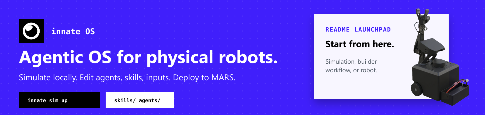

<div align="center">

# Innate OS

**The operating system for Innate robots.**

[](https://discord.gg/innate)
[](https://docs.innate.bot)
[](https://innate.bot)
[](https://docs.ros.org/en/humble/)

</div>

<p align="center">
  
</p>

Innate OS runs the robot and the simulator. It is where ROS 2, the Innate app, skills, agents, inputs, navigation, manipulation, training, logs, and updates come together.

You can use it before hardware arrives by running the simulator locally. Once you have a robot, the same OS becomes the runtime you operate through the Innate phone app, SSH, and the `innate` CLI.

> [!NOTE]
> Innate OS is in active development. APIs and features may change as the robot, simulator, and app mature.

| [Simulate It](#simulate-it) | [Build Behavior](#build-behavior) | [Operate A Robot](#operate-a-robot) |
| --- | --- | --- |
| Run the OS locally with a simulated robot and app-facing bridge. | Add agents, skills, and input devices in the workspace. | Connect the phone app, run skills, inspect logs, and apply updates. |

## Simulate It

From the repo root:

```bash
./innate setup
./innate sim up
```

This starts the Docker-based Innate OS runtime, the simulator, and the built frontend at [http://localhost:8000](http://localhost:8000). The terminal drops into a live dashboard with startup logs, simulator logs, brain logs, and runtime health.

<p align="center">
  
</p>

Useful simulator commands:

```bash
./innate sim up --vis       # open the native simulator viewer
./innate sim status         # show current runtime state
./innate sim logs simulator # inspect simulator logs
./innate sim down           # stop the runtime
```

See [`sim/launcher/README.md`](sim/launcher/README.md) for the full local simulator workflow.

## Build Behavior

Most builder-facing work should happen in `workspace/`. The OS internals live in `ros2_ws/`, but typical agents, skills, and inputs do not require touching ROS.

| Path | Purpose |
| --- | --- |
| [`workspace/innate_agents/`](workspace/innate_agents/) | Built-in agents shipped with Innate OS. |
| `workspace/custom_agents/` | Your local agents. Gitignored and created automatically when needed. |
| [`workspace/innate_skills/`](workspace/innate_skills/) | Built-in skills shipped with Innate OS. |
| `workspace/custom_skills/` | Your local or recorded skills. Gitignored and created automatically when needed. |
| [`workspace/inputs/`](workspace/inputs/) | Pure-Python input devices such as microphone, keyboard, or custom sensors. |
| `~/agents/`, `~/skills/` | Optional home-directory locations scanned in place for personal work. |

Skill IDs show where a skill came from:

```text
innate-os/wave      # built-in skill
local/my-skill      # local custom skill
```

The runtime hot-loads workspace changes after the relevant service restarts. Physical skills are recorded under `workspace/custom_skills/`, while shipped examples remain under `workspace/innate_skills/`.

## Operate A Robot

On a physical Innate robot, Innate OS is the runtime behind the phone app and robot services.

Common robot flow:

1. SSH into the robot.
2. Connect from the Innate phone app.
3. Use the app to operate the robot and trigger behavior.
4. Use the CLI to build, restart, inspect, update, and run skills.

```bash
innate build
innate restart
innate view
innate update status
innate update apply
innate skill list
innate skill run innate-os/wave
```

The simulator exercises the same app-facing OS path, so app and agent workflows can be tested locally before running them on hardware.

## What Is Included

| Capability | What it gives you |
| --- | --- |
| Simulation | A local robot loop with simulator, frontend, OS container, and brain connection. |
| App control | The bridge used by the Innate phone app and web UI to talk to the robot. |
| Agents and skills | Built-in and local behavior modules with clear shipped vs custom paths. |
| Inputs | Pure-Python input devices that can feed directives without ROS dependencies. |
| Navigation | Mapping, map-free motion, Nav2 navigation, and mode switching. |
| Manipulation | Arm/head control, demonstration recording, replay, and training hooks. |
| Training Manager | Local UI for skills, datasets, training runs, logs, and downloads. |
| Updates | Robot update scripts, service management, migrations, and release/dev update paths. |
| Telemetry | Robot logs and runtime telemetry upload paths for debugging and operations. |

## Repo Map

| Directory | Purpose |
| --- | --- |
| [`workspace/`](workspace/) | Builder-facing agents, skills, and inputs. |
| [`sim/`](sim/) | Local simulator runtime, launcher, frontend, assets, and environment data. |
| [`ros2_ws/`](ros2_ws/) | ROS 2 workspace for the robot runtime. |
| [`config/`](config/) | System configuration for DDS, systemd, udev, audio, Bluetooth, sounds, and shell setup. |
| [`scripts/`](scripts/) | CLI helpers, launch scripts, update system, and robot service tooling. |
| [`docs/`](docs/) | Architecture notes and developer-facing subsystem docs. |
| [`ci/`](ci/) | Docker and CI support for build/test workflows. |

## ROS 2 Runtime Packages

The main runtime packages live under [`ros2_ws/src`](ros2_ws/src). [`scripts/launch_ros_in_tmux.sh`](scripts/launch_ros_in_tmux.sh) shows how they are wired together at startup.

- **[maurice_control](ros2_ws/src/maurice_bot/maurice_control)** - top-level robot app node, rosbridge websocket server for the mobile/web app, and low-latency UDP receiver for leader-arm teleop.
- **[maurice_bringup](ros2_ws/src/maurice_bot/maurice_bringup)** - hardware bringup for motors, base, IMU, and LiDAR, plus `robot_state_publisher` for the TF tree.
- **[maurice_arm](ros2_ws/src/maurice_bot/maurice_arm)** - arm and head servo driver, MoveIt `move_group`, and KDL-based IK solver.
- **[maurice_cam](ros2_ws/src/maurice_bot/maurice_cam)** - stereo main camera, arm camera, VPI stereo depth estimator, WebRTC streamer, and stereo calibration action server.
- **[maurice_nav](ros2_ws/src/maurice_bot/maurice_nav)** - Nav2-based navigation, SLAM mapping, and the mode manager that switches between `mapfree`, `mapping`, and `navigation`.
- **[brain_client](ros2_ws/src/brain/brain_client)** - bridge to the Innate cloud brain, websocket client, skills action server, and user input manager.
- **[manipulation](ros2_ws/src/brain/manipulation)** - records and replays manipulation demonstrations and runs learned or scripted manipulation policies.
- **[innate_logger](ros2_ws/src/cloud/innate_logger)** - uploads robot logs and telemetry to the Innate cloud.
- **[innate_training_node](ros2_ws/src/cloud/innate_training_node)** - collects training episodes and pushes them to the training cloud.
- **[innate_uninavid](ros2_ws/src/cloud/innate_uninavid)** - UniNaVid vision-language navigation client.

## More Docs

- [`workspace/README.md`](workspace/README.md) - where agents and skills live.
- [`sim/launcher/README.md`](sim/launcher/README.md) - full `./innate sim` workflow.
- [`docs/INPUT_DEVICES.md`](docs/INPUT_DEVICES.md) - how to add input devices.
- [`ros2_ws/src/brain/brain_client/docs/agent-skills-design.md`](ros2_ws/src/brain/brain_client/docs/agent-skills-design.md) - agent and skill loading model.
- [`scripts/update/README.md`](scripts/update/README.md) - updates, services, and skill CLI commands.
- [`docs/SYSTEM_OVERVIEW.md`](docs/SYSTEM_OVERVIEW.md) - deeper architecture notes.
