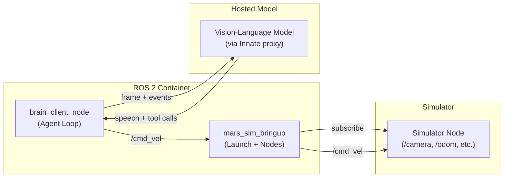
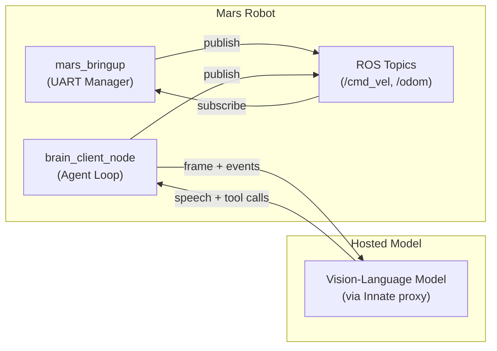

# Mars Robot System Documentation

This repository contains the code, configuration, and documentation for the Mars robot system. The system can run in two modes:

1. **Simulation Mode**: Where a simulator publishes mock sensor data (images, LiDAR, etc.) to ROS, and we run the same ROS nodes that would run on the real robot.
2. **Real-World Mode**: Where the Mars robot hardware (via UART/TCP or actual hardware drivers) publishes real sensor data, and receives real actuation commands.

Below is an overview of each major component, the communication protocols, and relevant message/service definitions.

---

## Table of Contents

- [Overall Architecture](#overall-architecture)
- [Components](#components)
  - [Mars Robot / Simulation](#mars-robot--simulation)
  - [ROS 2 Nodes & Packages](#ros-2-nodes--packages)
  - [Agent Loop](#agent-loop)
  - [Zenoh Discovery & Networking](#zenoh-networking)
  - [rosbridge](#rosbridge)
- [Protocols and Message Types](#protocols-and-message-types)
  - [ROS 2 Topics & Services](#ros-2-topics--services)
  - [Zenoh Protocol](#zenoh-protocol)
- [System Diagrams](#system-diagrams)
  - [Simulation Diagram](#simulation-diagram)
  - [Real Robot Diagram](#real-robot-diagram)
- [Build and Run Instructions](#build-and-run-instructions)
  - [Docker & Docker Compose](#docker--docker-compose)
  - [Local Development](#local-development)
- [FAQ / Troubleshooting](#faq--troubleshooting)

---

## Overall Architecture

**Core Idea**: We have a set of ROS 2 nodes that handle sensor input, motion commands, and external communication (cloud, simulator).  
- In **simulation mode**, a simulator node (or an external sim bridging over rosbridge) publishes mock data (e.g. images, LiDAR) to ROS.  
- In **real-world mode**, the hardware drivers (or a `UartManager`, `TcpManager`, etc.) publish **actual** sensor data.  

The **agent loop** runs on the robot inside `brain_client_node`: it snapshots the camera and pose, calls a hosted vision-language model, and acts on the reply by speaking or running a skill. Meanwhile, we also have a `rosbridge_server` that can allow external simulator connections.

---

## Components

Below is a brief description of each major piece. In the repository, these are located in various subfolders inside `ros2_ws/src`.

### Mars Robot / Simulation

- **Mars Robot**: A physical platform running ROS 2 (e.g. on a Jetson or SBC). Publishes topics like `/odom`, `/battery_state`, and receives `/cmd_vel`.
- **Simulation**: A software environment mimicking the robot's sensors (camera, LiDAR, etc.) and actuators. Publishes the same ROS 2 topics so that the rest of the system thinks it's dealing with a real robot.

### ROS 2 Nodes & Packages

1. **`mars_msgs`**: Custom message/service definitions (e.g. `LightCommand.srv`).
2. **`mars_bringup`**: Launch files and nodes for the real robot (UART drivers, battery manager).
3. **`mars_sim_bringup`**: Launch files and nodes for simulation (TCP manager or direct rosbridge).
4. **`brain_client`**: The on-robot agent loop plus the skills server. Snapshots sensors, calls the model, and runs skills.
5. **`config/dds/`** scripts: Facilitates DDS discovery server usage (setup scripts, XML templates).

### Agent Loop

Runs on the robot, inside `brain_client_node`. Each turn it:
- Snapshots the latest camera frame, pose, and any queued events (user speech, skill results).
- Calls a hosted vision-language model, reaching it through the Innate proxy (which holds the upstream key).
- Acts on the reply: speaks it, or starts/stops a skill via the `execute_skill` action.

See `ros2_ws/src/brain/brain_client/brain_client/README.md` for the package layout.

### Zenoh Networking

- We can run a **Zenoh Router** (`rmw_zenohd`), so that distributed ROS 2 nodes find each other on the network without heavy multicast.

- The environment variables in `config/dds/setup_dds.zsh` and `config/dds/start_zenoh_router.zsh` control how Zenoh is configured.

- You can use `start_zenoh_router.zsh {ip/hostname}` to connect your local ROS instance to the robot.

### rosbridge

- We may also run a **rosbridge_server** (port 9090) so that external simulators or web applications can subscribe/publish via JSON over WebSockets (`/odom`, `/cmd_vel`, etc.).

---

## Protocols and Message Types

### ROS 2 Topics & Services

Below is a summary of the main ROS 2 topics and services used. They are standard or custom:

| Topic/Service            | Type                              | Description                                                            |
|--------------------------|------------------------------------|------------------------------------------------------------------------|
| `/odom`                  | `nav_msgs/msg/Odometry`           | Robot's odometry data                                                  |
| `/camera/color/image_raw`| `sensor_msgs/msg/Image`           | RGB camera feed from either real or simulated source                   |
| `/cmd_vel`               | `geometry_msgs/msg/Twist`         | Velocity commands to drive the robot                                  |
| `/battery_state`         | `sensor_msgs/msg/BatteryState`    | Battery information                                                    |
| `/light_command`         | `mars_msgs/srv/LightCommand`   | Custom service for controlling robot lights                            |
| …                        | …                                  | (Add more as needed)                                                   |

### DDS Discovery Protocol

Every ROS node contains a Zenoh session which connects to `localhost:7447` by default. The Zenoh Router must be running at this address.

This behavior is controlled by scripts in the `dds` directory.

---

## System Diagrams

Below are two conceptual diagrams: one for **simulation**, one for the **real robot**. You can embed them in your markdown in a few ways:

1. **Mermaid** (GitHub now renders Mermaid diagrams directly).
2. **PlantUML** (requires a plug-in or pre-rendered images).
3. **Static Image** (e.g. PNG or SVG).

### Simulation Diagram

Mermaid Example

### Real Robot Diagram

Mermaid Example

